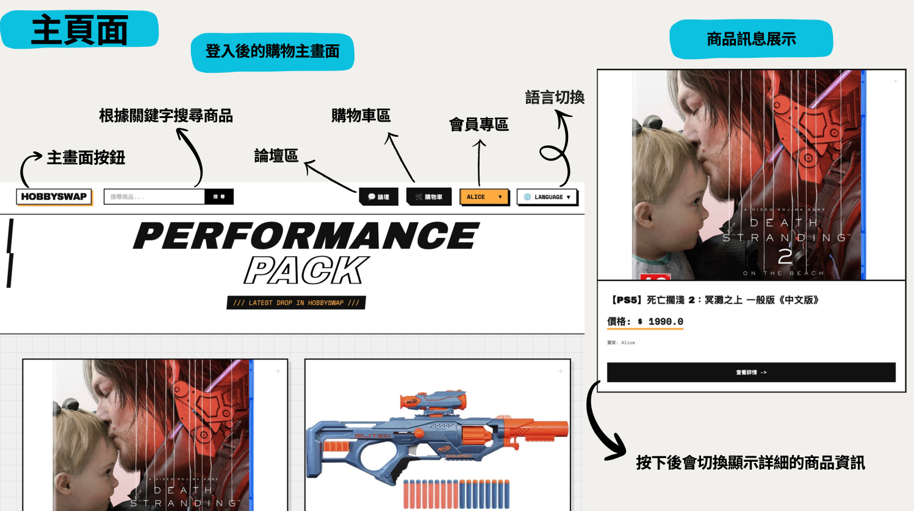
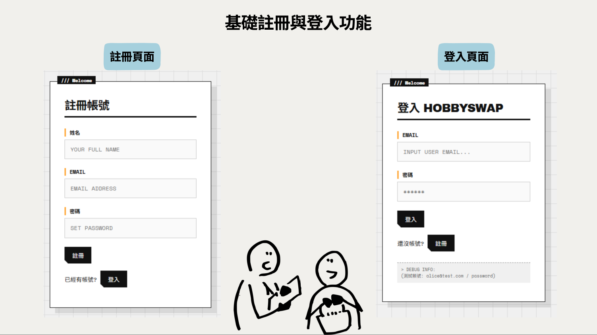
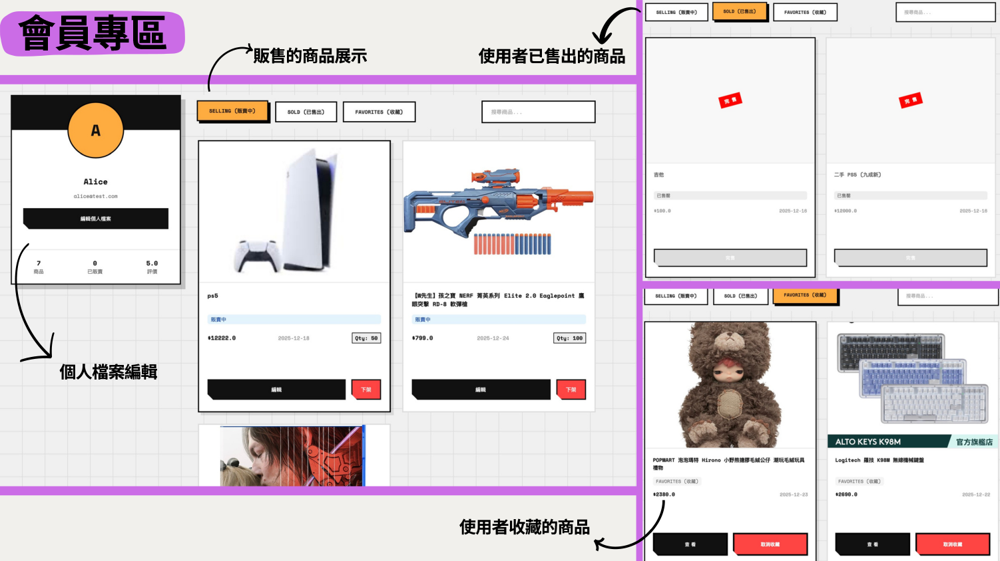
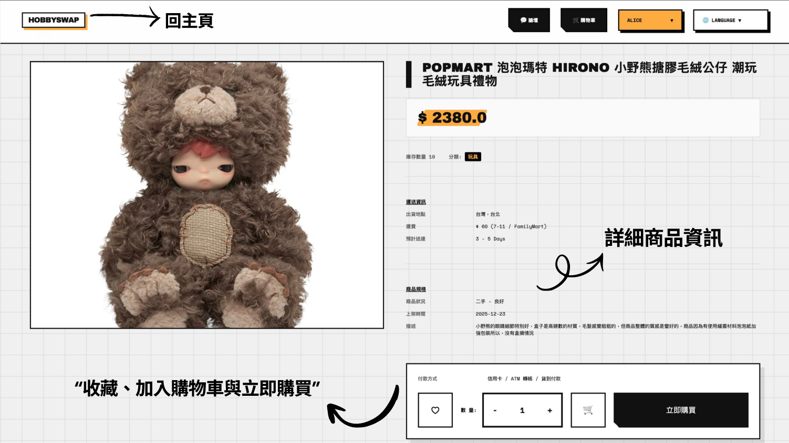
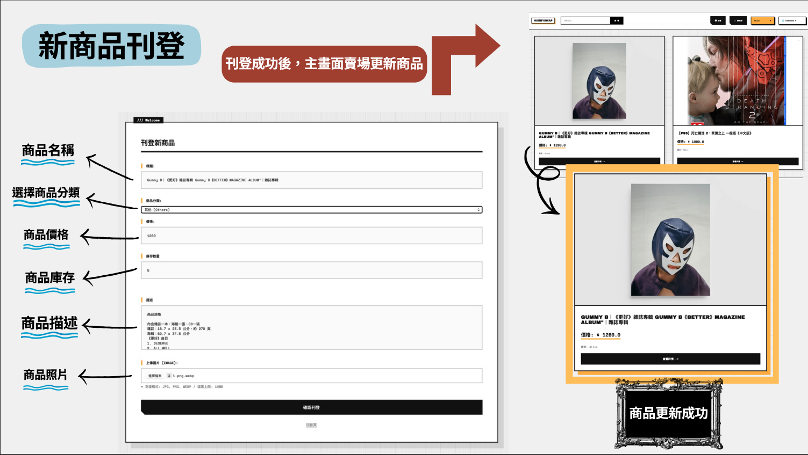
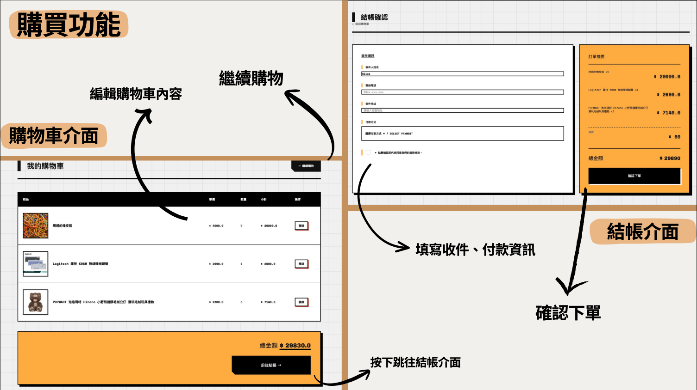
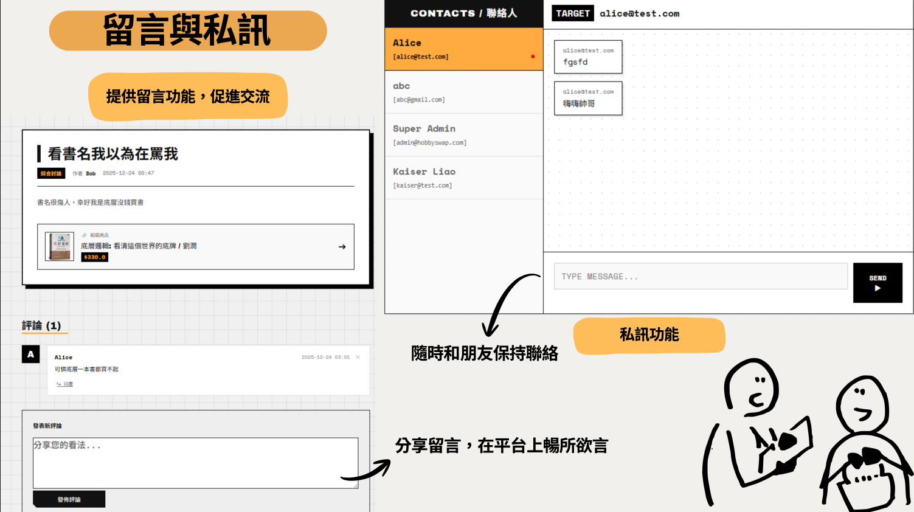
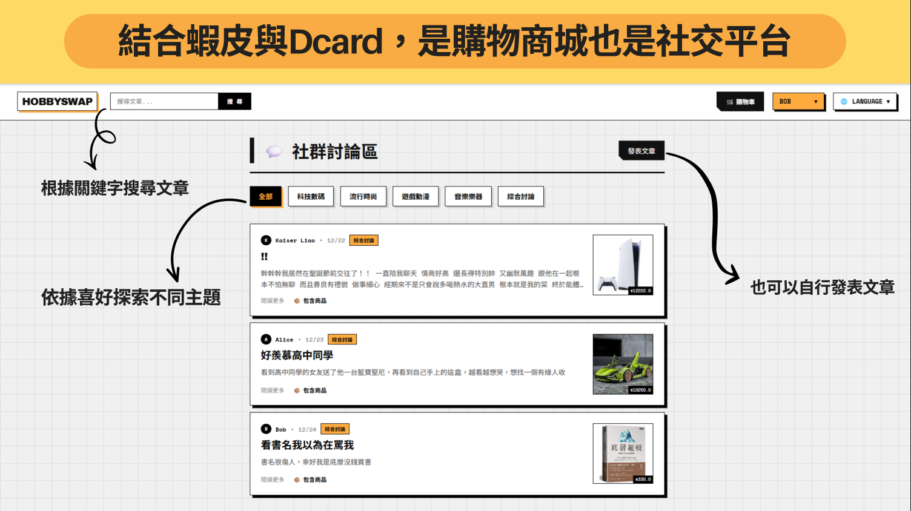
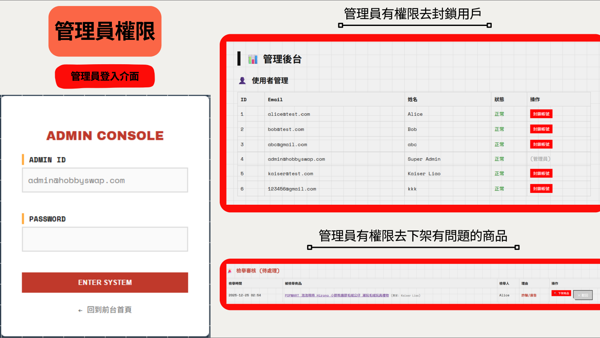

# HobbySwap 興趣交易平台

HobbySwap 是一個基於 Spring Boot 開發的線上社群與交易平台，專為擁有共同興趣的同好設計，提供物品買賣、論壇交流以及即時聊天等功能。

## 核心功能

* **會員系統**：用戶註冊、登入、個人首頁 (MyPage) 以及個人資料管理。
* **物品交易**：
  * 商品上架與展示
  * 購物車管理
  * 結帳流程
  * 訂單管理
* **社群論壇**：提供討論區讓用戶發表文章、回覆討論，依據不同分類交流興趣。
* **即時通訊**：支援 WebSocket 即時聊天功能，方便買賣雙方以及社群成員間的即時溝通 (包括私訊或群聊)。
* **多語系支持**：內建國際化支持，包含繁體中文，英文及日文。
* **後台管理**：管理員專屬的儀表板，支援平台營運相關的資料管理。

## 系統畫面


|                           主頁面                           |                                   基礎註冊與登入                                   |
| :---------------------------------------------------------: | :---------------------------------------------------------------------------------: |
|  |  |


|                            會員專區                            |                            商品頁面                            |
| :-------------------------------------------------------------: | :-------------------------------------------------------------: |
|  |  |


|                             新商品刊登                             |                            購買功能                            |
| :-----------------------------------------------------------------: | :-------------------------------------------------------------: |
|  |  |


|                             留言與私訊                             |                             社群討論區                             |
| :-----------------------------------------------------------------: | :-----------------------------------------------------------------: |
|  |  |


|                             管理員頁面                             |  |
| :-----------------------------------------------------------------: | :-: |
|  |  |

## 技術選型

* **後端架構**：Java 21, Spring Boot 3.5.x
* **安全機制**：Spring Security
* **資料存取**：Spring Data JPA
* **資料庫**：H2 Database
* **前端模板**：Thymeleaf, Thymeleaf Extras for Spring Security
* **即時通訊**：Spring Boot WebSocket
* **構建工具**：Maven

## 專案結構簡介

```text
src/main/java/com/hobbyswap/
├── config/       # Spring Configuration (Security, WebSocket, Web 等配置)
├── controller/   # Spring MVC Controllers (負責處理 HTTP 請求)
├── dto/          # Data Transfer Objects (資料傳輸物件)
├── model/        # JPA Entities (包含 User, Item, Cart, Order, ForumPost, ChatMessage 等實體模型)
├── repository/   # Spring Data JPA 介面 (資料存取層)
└── service/      # 業務邏輯層
src/main/resources/
├── static/       # 靜態資源 (CSS 等)
├── templates/    # Thymeleaf 前端頁面模板
└── application.properties # 系統運行配置設定
```

## 快速開始

### 1. 安裝必備環境

如果您從未有過 Java 開發經驗，請先確認您的電腦已安裝以下基礎軟體：

* **Git**: 用來將專案程式碼下載到電腦裡 ([📥 點此下載 Git](https://git-scm.com/downloads))。
* **JDK 21**: 這是執行 Java 與 Spring Boot 必備的程式引擎。推薦下載免費的 Eclipse Temurin 21 ([📥 點此下載 JDK 21](https://adoptium.net/zh-TW/temurin/releases/?version=21))。
  *(※ 安裝 JDK 時，請記得勾選「設為系統環境變數/Add to PATH」)*
* **不需安裝 Maven**: 本專案已內建 `mvnw` (Maven Wrapper 工具)，系統會自動處理所有的套件！

### 2.下載專案與「安裝相依套件」

這一步將把程式碼下載到本地，並讓系統自動從網路下載專案需要用到的所有套件。

1. **取得程式碼**：
   打開您的終端機 (Terminal / PowerShell / 命令提示字元)，複製並貼上以下指令：

   ```bash
   git clone https://github.com/shin321470/hobbyswap.git
   cd hobbyswap
   ```
2. **安裝所有套件依賴**：
   在這個專案裡，所有需要的套件都記錄在 `pom.xml` 裡。請在終端機輸入下列指令，讓系統**自動幫您下載並安裝所有的套件**。*(請注意：第一次執行時會下載大量的相關檔案，可能會需要花費幾分鐘的時間，請耐心等待直到終端機顯示 `BUILD SUCCESS` 為止。)*

   * **Windows**:
     ```bash
     .\mvnw clean install -DskipTests
     ```
   * **Mac / Linux**:
     ```bash
     ./mvnw clean install -DskipTests
     ```

### 3. 環境配置 (IDE 與設定檔)

1. **應用程式設定**：
   專案的核心設定檔位於 `src/main/resources/application.properties`。在開始執行前，您可依需求修改伺服器埠口與資料庫設定（預設使用 H2 記憶體資料庫，不需額外安裝）：

   ```properties
   # 伺服器設定
   server.port=8080

   # H2 資料庫設定
   spring.datasource.url=jdbc:h2:mem:hobbyswapdb
   spring.datasource.driverClassName=org.h2.Driver
   spring.datasource.username=sa
   spring.datasource.password=

   # JPA/Hibernate 設定
   spring.jpa.hibernate.ddl-auto=update
   spring.jpa.show-sql=true

   # 開啟 H2 控制台
   spring.h2.console.enabled=true
   spring.h2.console.path=/h2-console
   ```
2. **開發工具 (IDE) 匯入**：

   * **IntelliJ IDEA**: 點選 `File -> Open`，選擇專案根目錄即可。IDEA 會自動識別 `pom.xml` 並下載 Maven 依賴。
   * **Eclipse**: 點選 `File -> Import -> Existing Maven Projects` 匯入。
   * **VS Code**: 建議安裝 `Extension Pack for Java` 和 `Spring Boot Extension Pack` 擴充套件，並直接開啟專案資料夾。

### 4. 啟動平台

環境、套件安裝齊全後，即可啟動這個購物平台！

1. 執行應用程式啟動指令：

   * **Windows**:
     ```bash
     .\mvnw spring-boot:run
     ```
   * **Mac / Linux**:
     ```bash
     ./mvnw spring-boot:run
     ```

   *(請等候幾秒鐘，當看到類似 `Started HobbySwapApplication in xxx seconds` 的字樣，代表啟動成功了！)*
2. 開啟您的瀏覽器，並訪問以下網址：
   [http://localhost:8080](http://localhost:8080)
   (接下來，您可以嘗試註冊一個帳號，開始體驗平台的功能了！)

## 國際化

HobbySwap 支援多語系切換，位於 `src/main/resources/` 的 `.properties` 檔案負責管理：

* `messages.properties` - 繁體中文語系
* `messages_en.properties` - 英文語系
* `messages_ja.properties` - 日文語系

## H2 資料庫主控台

在開發環境下，專案預設搭載了輕量級的 H2 資料庫。
如果 `application.properties` 中開啟了 H2 Console，您可以透過瀏覽器查看目前資料庫的 Table 結構與資料。

* 預設路徑：`http://localhost:8080/h2-console`
* 詳細連線資訊請參照 `application.properties` 內的配置。
